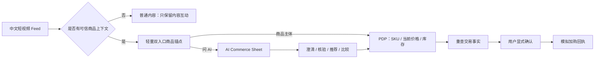
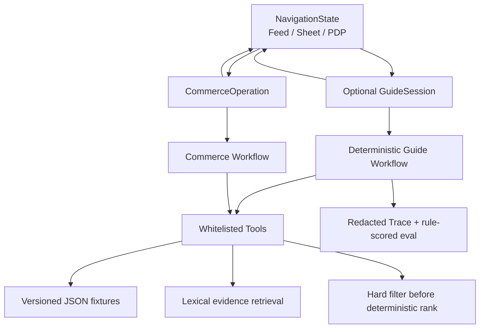
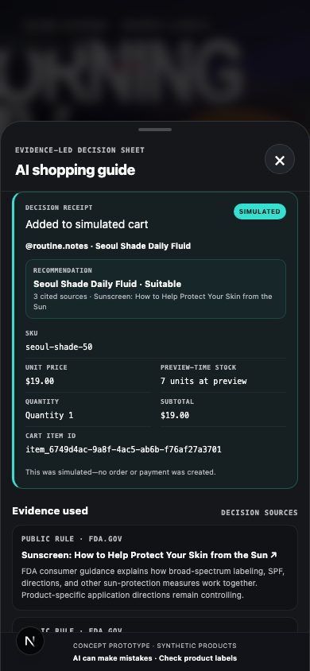
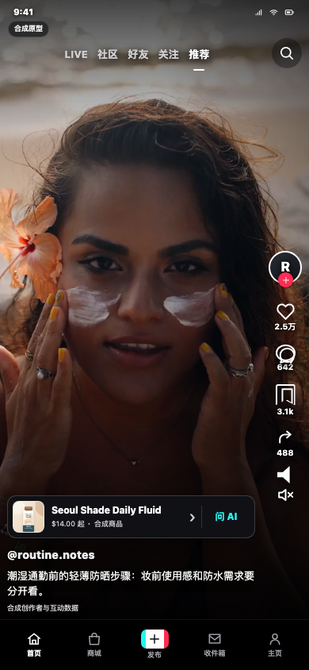

# AI Shopping Agent — US K-Beauty Sunscreen Guide

一个面向美国市场的跨境 K-Beauty 防晒 AI 导购概念原型：用户在 TikTok 风格的可购物短视频中被商品种草后，通过 `Ask AI` 进入对话，由系统核实内容主张、识别购买约束、解释适配性，并完成商品比较、SKU 选择与模拟加购。

> [!IMPORTANT]
> 当前仓库已交付一个可运行的 **TikTok Shop-inspired 中文体验重设计 Demo**：普通 / 可购物 Feed、轻量商品与“问 AI”双入口、AI Commerce Sheet、独立 PDP、SKU 选择、事实复核、显式确认和模拟加购已在生产构建的 Chromium 中验证。8 条必需旅程全部通过，并保存 390×844 移动端、1440×1000 桌面面试态和 390×844 普通 Feed 三张正式截图。它仍是基于小型合成 fixture 的确定性原型，不是 TikTok 官方产品，也没有接入真实 LLM、Hybrid RAG、真实用户、支付或业务流量。

> [!NOTE] Foundation 历史基线不被重设计覆盖
> 2026-08-05 的冻结基线仍独立保留：source commit `cd18147f7eb1e309aa6043a1262a28f0c4349b4d`，3 SPU / 6 SKU、1 个 `ContentContext`、3 份证据、6 个规则案例 6/6、119 个 API 测试、68 个 Web 测试、2 条旅程 × 2 个 Chromium viewport = 4/4、1 条 Trace / 11 条脱敏事件。其固定 SKU 价格为 `$14/$19`、`$17/$24`、`$16/$22`，历史截图与 manifest 均未被当前正式截图替换。该基线是 deterministic workflow + lexical retrieval，不含真实 LLM、Hybrid RAG、用户研究或业务结果。

## 为什么做这个产品

内容电商擅长激发兴趣，但用户从“看起来不错”到“敢于购买”之间仍有一段决策缺口：

- 创作者的功效或体验主张是否有可信依据；
- 防晒是否适合自己的肤质、肤色、敏感情况、妆前需求与使用场景；
- 同类商品很多，应该继续买当前商品，还是换一个更匹配的；
- 价格、库存、规格等交易事实能否被准确确认，而不是被模型编造。

本项目的核心价值不是让模型“多聊几轮”，而是用尽可能少的追问，把内容兴趣转化成一个**有证据、满足硬约束、可继续交易的购买决定**。

## MVP 定义

| 维度 | 当前定义 |
|---|---|
| 市场 | 美国 |
| 首个品类 | 跨境 K-Beauty 防晒 |
| 主入口 | TikTok 风格可购物短视频内的 `Ask AI` |
| 目标用户 | 已被内容种草、但不确定商品是否适合自己的消费者 |
| 核心任务 | 主张核实 → 约束澄清 → 适配判断 → 替代推荐 → 比较 → SKU 确认 |
| 交易终点 | 模拟加购成功，不接真实支付与履约 |
| 数据策略 | 合成商品、内容与评论数据；真实公开的美国规则与安全边界 |
| 形态 | 移动端优先的响应式 Web，同时支持桌面面试演示 |
| 北极星指标 | 质量门槛通过后的有效导购完成率 |

MVP 不包含真实 TikTok 接入、真实支付履约、实时直播理解、全美妆品类、医疗诊断、商家后台或为了展示复杂度而搭建的多 Agent 系统。

搜索是已确认的第二入口，但不属于首个可运行版本。首个纵向切片必须先锁定并测试 `entry_point = content | search` 与 `search_query` 契约；进入 `UNDERSTAND` 后再派生 `query_intent = exploratory | exact`，但不实现搜索 UI 或搜索排序。Phase 2 之后才增加自然语言探索式搜索；精确 SKU 搜索仍优先走传统搜索，只在用户需要解释或比较时进入 AI 导购。

## 体验主路径



当前实现有两条等价交易入口：用户可以从 Feed 直接进入 PDP，不依赖 AI；也可以先在 Sheet 中形成决策，再查看当前或替代商品并返回原 AI 状态。普通 Feed 不显示商品锚点或 AI。界面使用自有图标、合成商品与有许可的竖屏视频，清楚标注为求职作品集概念原型，不冒充 TikTok 官方产品。

## 产品架构与真实能力边界

产品理想态属于 Agent 产品，但当前可运行 Foundation 刻意先实现确定性基线：

- **当前 Deterministic Workflow** 用显式规则解析已冻结的预算、香型、防水和妆效表达，推进状态，执行必做检查、硬约束、安全边界与加购确认，并调用固定白名单 Tool；当前没有真实模型推理或自由工具选择；
- **Foundation Tools** 从版本化 JSON fixtures 读取内容、商品和证据，以词法匹配检索证据，先做结构化硬过滤再做确定性软偏好排序，并生成比较/模拟购物车事实；
- **Schema 与测试充当当前 verifier 边界**，校验 API、比较和购物车响应；完整生成式输出 Verifier 随真实 LLM 一起进入后续阶段。

重设计把“用户现在看到什么”“AI 决策到哪一步”“交易是否有权写入”拆成三个控制面，避免一个聊天 session 同时承担导航、推荐和购物车权限：

| 控制面 | 唯一职责 | 关键边界 |
|---|---|---|
| `NavigationState` | 前端维护 Feed / PDP、Overlay、入口来源与返回栈 | 只控制呈现，不授权任何业务动作 |
| `GuideSession`（可选） | 点击“问 AI”后维护约束、决策、比较和 `guide_revision` | Feed 直达 PDP 时不存在；AI 只能提出决策建议 |
| `CommerceOperation` | 维护 SKU、交易事实、`transaction_revision`、确认和幂等对账 | 独立于 Guide；只有用户动作 + Commerce Workflow 可以写模拟购物车 |

因此 AI 推荐不会直接加购：AI 只把经验证的商品与来源带入 PDP，Commerce Workflow 再校验商品/SKU 授权、事实指纹、revision、单次 confirmation token 和幂等键。价格变化必须展示 diff 并重新确认；网络结果未知必须用同一幂等键查询，而不是盲目重试写入。



| 当前已验证 | 后续仍待实现 |
|---|---|
| Next.js + TypeScript、FastAPI、进程内 session、JSON fixtures、词法检索、硬过滤/确定性排序、白名单 Tool、1 条黄金 Trace（11 条脱敏事件记录）、显式模拟加购确认 | 真实 LLM Shopping Agent、可替换模型适配层、PostgreSQL + pgvector、BM25 + Vector + RRF/Reranker、授权长期偏好、实时多模态、搜索 UI、生产可观测与部署 |

先不接 LLM 是一个产品基线决策：先证明交易事实、硬约束、证据、状态与确认边界能被确定性测试锁住；后续模型接入必须在同一套回归上证明新增价值，而不能把“会生成语言”误写成推荐质量。

## 数据与评测承诺

结构化、版本化的商品事实是价格、库存、SKU、促销与配送信息的唯一来源：当前 Foundation 使用仓库内 JSON fixtures，后续再迁移到数据库。创作者内容、OCR、评论和用户输入都视为不可信输入；没有证据时必须说明信息不足或拒绝给出确定性判断。

当前已提交一个六案例的确定性 Foundation 回归集，而不是在演示后手写结果：

- `golden-daily`、`water-40`、`zero-match`、`medical-boundary`、`injection-shaped-text`、`search-contract`；
- 规则评分器实测为 6/6、fixture-suite pass rate 1.0；它只证明这 6 个冻结案例在来源 commit 上通过，不代表真实用户、真实模型或广泛商品质量；
- 真实浏览器覆盖 golden 与 zero-match 两条旅程，分别在 390×844 移动 Chromium 和 1440×1000 桌面 Chromium 运行，共 4 个用例；
- clean-source release gate 实测 119 个 API 测试与 68 个 Web 单元测试通过；这些是工程回归计数，不是产品质量分数；
- 仓库只提交 1 条代表性黄金 Trace，共 11 条允许的状态、Tool 和模拟购物车脱敏事件记录，不含原始用户消息、确认 token 或隐藏推理。

在这条历史基线之上，2026-08-07 又新增了一个**浏览器产品回归层**：

- 8/8 必需旅程实跑：Feed 直达 PDP、AI 替代品往返、AI 推荐加购、普通 Feed、零候选单项放宽、安全边界、价格变化重确认、未知提交结果幂等对账；
- 普通 E2E 共收集 38 项，26 passed、12 intentional skips、0 failed；production capture 运行是 28 passed、10 intentional skips、0 failed。8 条重设计旅程只在一个 fresh mobile API 进程中执行，避免桌面项目重复完整交易矩阵；既有 PDP focus 三条回归仍在 mobile/desktop 双 project 运行，共 6/6；桌面同时使用同一页面/API 完成响应式回归与正式 AI Sheet 截图；
- 当前 release gate 为 234 个 API 测试、193 个 Web 测试、Foundation eval pytest 14/14、规则 runner 6/6，并通过 contracts、layout、ESLint、Ruff 和 production build；这些数字是工程回归，不是用户或模型质量得分；
- Playwright trace 与本地证据进程 access log 明确关闭；本次 production E2E 运行时生成的 confirmation token / idempotency key 未进入 retained trace、matcher failure、截图、access log 或提交。这个窄结论不表示仓库没有显式合成测试常量；幂等键当前位于 reconciliation URL，生产化前仍需避免被 proxy/access log 持久化。

完整命令、逐旅程网络状态、正式截图 checksum、fixture/media inventory 和局限见 [TikTok 重设计验证记录](./artifacts/evidence/tiktok-redesign-verification.md)。

后续完整评测仍按以下层次扩展：

- 组件层：意图与关键约束、澄清、检索与排序、引用、主张核实、工具参数、记忆、安全和多模态抽取；
- 端到端层：内容进入、约束冲突、无候选、库存过期、用户改口、比较加购、超时降级和提示注入；
- 产品层：任务完成质量、用户操作漏斗、延迟、成本与小规模可用性研究；
- 机制层：所有 P0/P1 坏例进入回归集；确定性事实优先使用规则评分，LLM-as-a-Judge 只有在人类校准后才作为辅助。

原始大体积 Trace 与逐次评测运行默认保存在本地或外部制品存储，不直接提交 Git；仓库必须版本化保存运行 manifest、配置/commit 指针、校验和、汇总结果和经脱敏的代表性 Trace 样本。这样既控制仓库体积，也能让结论回到可复现证据，而不是只留下一个手写分数。

详细的目标、阶段出口和风险见 [PLAN.md](./PLAN.md)。当前任务状态与证据入口见 [TASKS.md](./TASKS.md)。

## Foundation 证据快照



- [完整验证记录](./artifacts/evidence/foundation-verification.md)
- [可复现运行 manifest](./artifacts/evidence/foundation-run-manifest.json)
- [六案例 fixture suite](./evals/cases/foundation-cases.jsonl)
- [1 条黄金 Trace（11 条脱敏事件记录）](./artifacts/traces/samples/foundation-golden.jsonl)
- [移动端终态截图](./artifacts/screenshots/foundation-mobile.png)

## TikTok 重设计证据快照

| 证据 | 能证明什么 | 不能证明什么 |
|---|---|---|
| [重设计验证记录](./artifacts/evidence/tiktok-redesign-verification.md) | 生产构建、8 条产品旅程、当前测试门和媒体来源可复跑 | 真实 LLM、真实用户、业务增量或生产可靠性 |
| [可购物 Feed · 390×844](./artifacts/screenshots/tiktok-redesign-mobile.png) | 商品锚点、右侧轨、中文平台壳和安全区布局 | “问 AI”发现率或用户理解 |
| [桌面面试态 · 1440×1000](./artifacts/screenshots/tiktok-redesign-desktop.png) | 同一 390×844 手机路径与 AI 决策 Sheet，没有第二套假页面 | 桌面交易旅程重复跑了 8 次 |
| [普通 Feed · 390×844](./artifacts/screenshots/tiktok-redesign-normal-feed.png) | 没有商品上下文时不展示商业/AI 能力 | TikTok 全量内容分布 |



## 本地安装、启动与验证

要求：Node.js、pnpm 11、Python 3.12+、uv，以及 Playwright Chromium。以下命令已在 Node.js 24.14.0、pnpm 11.20.0、Python 3.14.5 与 uv 0.11.14 的本地 Foundation 基线上实际运行；这些是本次验证环境，不代表全部可兼容版本。

```bash
pnpm install --frozen-lockfile
uv --directory apps/api sync --frozen
pnpm --dir apps/web exec playwright install chromium
```

分别在两个终端启动 API 与 Web：

```bash
uv --directory apps/api run uvicorn app.main:app --host 127.0.0.1 --port 8000
```

```bash
NEXT_PUBLIC_API_BASE_URL=http://127.0.0.1:8000/api/v1 pnpm --dir apps/web dev --hostname 127.0.0.1 --port 3000
```

打开 `http://127.0.0.1:3000`。点击商品锚点主体可直接进入 PDP；点击“问 AI”进入决策 Sheet；滑到第二条内容可查看无商业入口的普通 Feed。可复现的演示场景仅允许：`?scenario=normal`、`?scenario=price-changed`、`?scenario=out-of-stock`、`?scenario=commit-status-unknown`。常用验证命令：

```bash
pnpm check:layout
uv --directory apps/api run ruff check app tests ../../evals
uv --directory apps/api run pytest tests -q
uv --directory apps/api run python -m scripts.export_openapi
pnpm --dir packages/contracts generate
git diff --exit-code -- packages/contracts/openapi.json packages/contracts/src/api.ts
pnpm test:web
pnpm lint:web
pnpm --dir apps/web build
uv --directory apps/api run python ../../evals/run_foundation.py
pnpm test:e2e
```

Foundation 历史 release gate 见 [Foundation 验证记录](./artifacts/evidence/foundation-verification.md)；当前重设计 release gate、命令时间、真实计数、secret scan 与制品校验见 [TikTok 重设计验证记录](./artifacts/evidence/tiktok-redesign-verification.md)。

## 当前状态

| 能力 | 状态 |
|---|---|
| 产品范围与关键原则 | 已确认 |
| 可运行前后端 | TikTok-inspired 重设计本地链路已实现并在 production Chromium 验证 |
| 合成商品与场景数据 | 3 SPU / 6 SKU、1 ContentContext、3 evidence documents |
| Workflow / Tools | 确定性基线已实现并评测；真实 LLM Agent 未实现 |
| RAG | 词法证据检索基线已评测；向量/Hybrid/Reranker 未实现 |
| 自动评测 | 6 个冻结案例规则评分 6/6；不代表广泛模型/产品质量 |
| Foundation 历史浏览器基线 | 2 条旅程 × 2 个 Chromium viewport = 4/4；source commit `cd18147…` |
| 重设计浏览器旅程 | 8/8 必需旅程；production E2E 28 passed / 10 intentional skips / 0 failed；PDP focus 双 project 6/6 |
| 三控制面 | `NavigationState` / 可选 `GuideSession` / `CommerceOperation` 已实现并回归；AI 无购物车写权限 |
| 用户/业务结果 | 未研究、未上线、未测转化 |
| 部署地址 | 无 |

## 双层项目索引

- 工程实现与原始证据：本仓库（代码、schema、合成数据、prompt、trace、评测脚本与原始报告）
- 产品知识与面试叙事：本地知识控制室 [AI 导购 Agent — 项目总控](../../AI产品经理/项目实战/AI导购Agent/00-项目总控.md)

知识层记录“为什么这样做、产品取舍是什么、证据能回答哪些面试问题”；本仓库保存“系统实际做了什么以及如何验证”。两层通过链接互相索引，但不重复维护同一份事实。

## 文档入口

- [PLAN.md](./PLAN.md)：阶段路线、里程碑、出口条件、风险与依赖
- [TASKS.md](./TASKS.md)：当前任务台、真实状态和证据路径
- [AGENTS.md](./AGENTS.md)：后续 AI Agent 的项目操作契约
- [知识控制室](../../AI产品经理/项目实战/AI导购Agent/00-项目总控.md)：产品判断、概念覆盖、评测设计与面试索引
