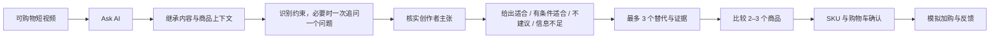
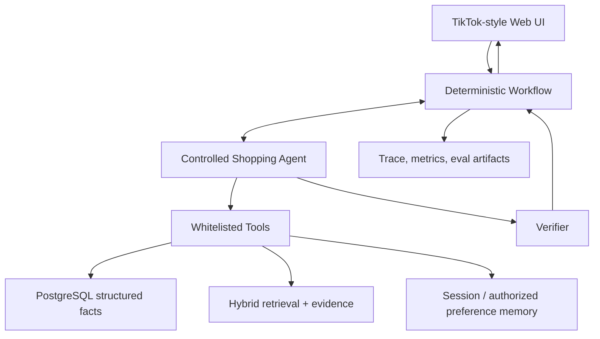

# AI Shopping Agent — US K-Beauty Sunscreen Guide

一个面向美国市场的跨境 K-Beauty 防晒 AI 导购概念原型：用户在 TikTok 风格的可购物短视频中被商品种草后，通过 `Ask AI` 进入对话，由系统核实内容主张、识别购买约束、解释适配性，并完成商品比较、SKU 选择与模拟加购。

> [!IMPORTANT]
> 当前仓库处于 **Planning / Foundation** 阶段。产品范围、总体架构和评测承诺已定义；可运行应用、商品数据、模型调用、自动化评测与演示结果均尚未实现。本文不会把规划目标表述成已完成结果。

## 为什么做这个产品

内容电商擅长激发兴趣，但用户从“看起来不错”到“敢于购买”之间仍有一段决策缺口：

- 创作者的功效或体验主张是否有可信依据；
- 防晒是否适合自己的肤质、肤色、敏感情况、妆前需求与使用场景；
- 同类商品很多，应该继续买当前商品，还是换一个更匹配的；
- 价格、库存、规格等交易事实能否被准确确认，而不是被模型编造。

本项目的核心价值不是让模型“多聊几轮”，而是用尽可能少的追问，把内容兴趣转化成一个**有证据、满足硬约束、可继续交易的购买决定**。

## MVP 定义

| 维度 | 当前定义 |
|---|---|
| 市场 | 美国 |
| 首个品类 | 跨境 K-Beauty 防晒 |
| 主入口 | TikTok 风格可购物短视频内的 `Ask AI` |
| 目标用户 | 已被内容种草、但不确定商品是否适合自己的消费者 |
| 核心任务 | 主张核实 → 约束澄清 → 适配判断 → 替代推荐 → 比较 → SKU 确认 |
| 交易终点 | 模拟加购成功，不接真实支付与履约 |
| 数据策略 | 合成商品、内容与评论数据；真实公开的美国规则与安全边界 |
| 形态 | 移动端优先的响应式 Web，同时支持桌面面试演示 |
| 北极星指标 | 质量门槛通过后的有效导购完成率 |

MVP 不包含真实 TikTok 接入、真实支付履约、实时直播理解、全美妆品类、医疗诊断、商家后台或为了展示复杂度而搭建的多 Agent 系统。

搜索是已确认的第二入口，但不属于首个可运行版本。首个纵向切片必须先锁定并测试 `entry_point = content | search` 与 `search_query` 契约；进入 `UNDERSTAND` 后再派生 `query_intent = exploratory | exact`，但不实现搜索 UI 或搜索排序。Phase 2 之后才增加自然语言探索式搜索；精确 SKU 搜索仍优先走传统搜索，只在用户需要解释或比较时进入 AI 导购。

## 体验主路径

界面将复现内容电商的关键交互结构，例如竖屏视频、创作者信息、商品锚点、右侧操作栏、AI 底部抽屉、结构化决策卡片和购物车反馈；但会清楚标注为求职作品集概念原型，不冒充 TikTok 官方产品，也不复制受保护的品牌资产。

## 产品架构

这个项目属于 Agent 产品，但不把所有步骤都交给 Agent：

- **Shopping Agent** 负责理解自然语言和软偏好、决定是否需要高信息量追问、选择下一项白名单工具、组织面向用户的解释；
- **Deterministic Workflow** 负责状态推进、必做检查、硬约束、安全边界、工具调用预算、超时与加购确认；
- **Tools** 负责内容上下文、商品事实、证据检索、主张核实、候选过滤、排序、比较、偏好和购物车；
- **Verifier** 在输出前检查事实来源、证据引用、安全规则和结构化响应格式。

规划中的技术基线是 Next.js + TypeScript、Python FastAPI、PostgreSQL + pgvector、混合检索与可追踪的模型适配层。具体 Agent 编排框架和模型供应商将在同一最小场景上做可替换对比后再锁定，当前不把某个 SDK 写成既定事实。

## 数据与评测承诺

结构化数据库是价格、库存、SKU、促销与配送事实的唯一来源；创作者内容、OCR、评论和用户输入都视为不可信输入。模型没有证据时必须说明信息不足或拒绝给出确定性判断。

项目将同步建设可复跑评测，而不是在演示完成后补几条案例：

- 组件层：意图与关键约束、澄清、检索与排序、引用、主张核实、工具参数、记忆、安全和多模态抽取；
- 端到端层：内容进入、约束冲突、无候选、库存过期、用户改口、比较加购、超时降级和提示注入；
- 产品层：任务完成质量、用户操作漏斗、延迟、成本与小规模可用性研究；
- 机制层：所有 P0/P1 坏例进入回归集；确定性事实优先使用规则评分，LLM-as-a-Judge 只有在人类校准后才作为辅助。

原始大体积 Trace 与逐次评测运行默认保存在本地或外部制品存储，不直接提交 Git；仓库必须版本化保存运行 manifest、配置/commit 指针、校验和、汇总结果和经脱敏的代表性 Trace 样本。这样既控制仓库体积，也能让结论回到可复现证据，而不是只留下一个手写分数。

详细的目标、阶段出口和风险见 [PLAN.md](./PLAN.md)。当前任务状态与证据入口见 [TASKS.md](./TASKS.md)。

## 当前状态

| 能力 | 状态 |
|---|---|
| 产品范围与关键原则 | 已确认 |
| 工程控制文档 | 已建立 |
| 实施级任务计划 | 已建立，尚未执行 |
| 可运行前后端 | 未实现 |
| 合成商品与场景数据 | 未实现 |
| 模型 / Agent / Workflow | 未实现 |
| 自动评测与真实结果 | 未实现 |
| 部署地址 | 无 |

因此目前没有可信的安装或运行命令。等工程骨架落地后，README 才会补充经过实际验证的环境要求、启动命令、测试命令和部署地址。

## 双层项目索引

- 工程实现与原始证据：本仓库（代码、schema、合成数据、prompt、trace、评测脚本与原始报告）
- 产品知识与面试叙事：本地知识控制室 [AI 导购 Agent — 项目总控](../../AI产品经理/项目实战/AI导购Agent/00-项目总控.md)

知识层记录“为什么这样做、产品取舍是什么、证据能回答哪些面试问题”；本仓库保存“系统实际做了什么以及如何验证”。两层通过链接互相索引，但不重复维护同一份事实。

## 文档入口

- [PLAN.md](./PLAN.md)：阶段路线、里程碑、出口条件、风险与依赖
- [TASKS.md](./TASKS.md)：当前任务台、真实状态和证据路径
- [AGENTS.md](./AGENTS.md)：后续 AI Agent 的项目操作契约
- [知识控制室](../../AI产品经理/项目实战/AI导购Agent/00-项目总控.md)：产品判断、概念覆盖、评测设计与面试索引
